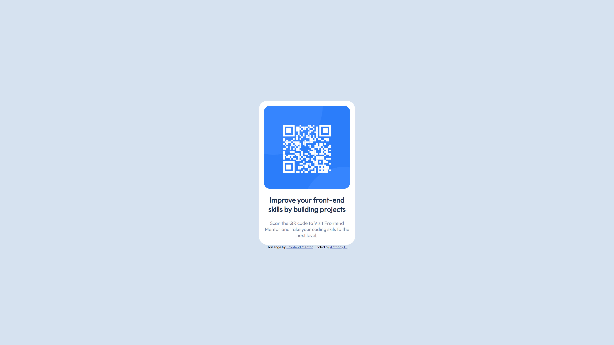

# Frontend Mentor - QR code component solution

This is a solution to the [QR code component challenge on Frontend Mentor](https://www.frontendmentor.io/challenges/qr-code-component-iux_sIO_H). Frontend Mentor challenges help you improve your coding skills by building realistic projects.

## Table of contents

- [Overview](#overview)
  - [Screenshot](#screenshot)
  - [Links](#links)
- [My process](#my-process)
  - [Built with](#built-with)
  - [What I learned](#what-i-learned)

## Overview

This is an overview of my QR code Design Challenge

### Screenshot



### Links

- Solution URL: (https://github.com/crossant123/qr-code-challenge)
- Live Site URL: (https://crossant123.github.io/)

## My process

I first used Figma to sketch out container size and border radius.
I took time creating the containers and deciding the css aproach to take.

### Built with

- Semantic HTML5 markup
- CSS custom properties
- Flexbox

### What I learned

I used this challenge to properly understand CSS flexbox and how I can use it to create interesting elements with clean design properties. I feel this project does a good job at highlighting early mistakes and challenges you can make when learning css and I did make some. I used this project to reinforce my understandings of margin and text manipulation.

Code Snippets I'm proud of: see below:

```html
<div class="Content-container">
	<h2 class="content-topic">
		Improve your front-end skills by building projects
	</h2>
	<p class="content-text">
		Scan the QR code to Visit Frontend Mentor and Take your coding skils to the
		next level.
	</p>
</div>
```

```css
.container-outer {
	position: relative;
	width: 300px;
	height: 450px;
	background-color: hsl(0, 0%, 100%);
	border-radius: 25px;
	display: flex;
	justify-content: center; /* Center the child element horizontally */
	align-items: center;
	flex-direction: column;
}
.qr-container {
	background-color: hsl(217, 65%, 52%);
	width: 90%;
	max-width: 400px;
	height: 60%;
	border-radius: 20px;
	overflow: hidden;
	margin-top: 5%;
}
.Content-container {
	width: 90%;
	max-width: 400px;
	display: flex;
	flex-direction: column;
	align-items: center;
	text-align: center;
	justify-content: space-between;
	padding: 10px 0;
}
```
